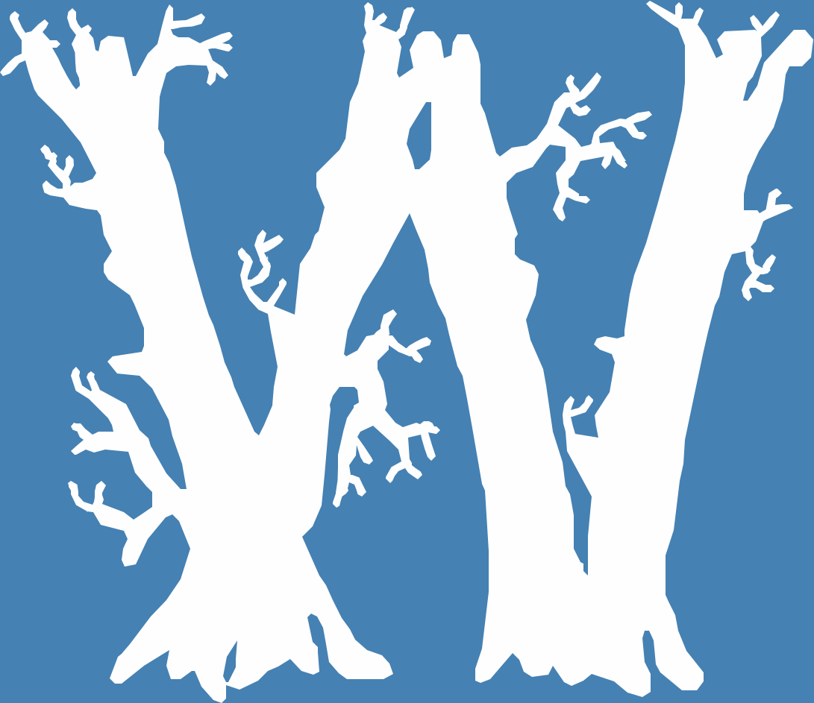

# Flattening Quadratic Bézier Curves

Here I've implemented the algorithm presented by Raph Levien [here](https://raphlinus.github.io/graphics/curves/2019/12/23/flatten-quadbez.html) and used it to render a few glyphs from some TrueType fonts. Here are 3 glyphs:




I've also implemented the De Casteljau method and rendered the same glyphs with it (images named `glyph_<index>_recursive_subdivision`). The differences are practically invisible, but Levien's method requires less number of segments generated and is _much_ faster.

# Reproduce the results

As long as you have [Rust](https://www.rust-lang.org/tools/install) installed, to build this project and see the outputs you only need to:
```sh
git clone https://github.com/AlexandruIca/FlatteningQuadraticBezierCurves
cd FlatteningQuadraticBezierCurves/

cargo run

# Now a bunch of `.png`s will be generated and you can see the results for yourself
```

If you use Nix, you can just `nix-shell` inside this repo and you're good to go.